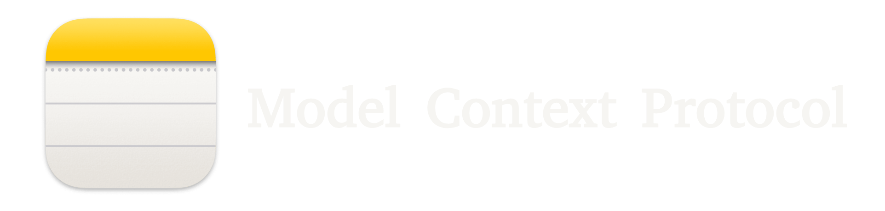

# MCP Apple Notes



> **Fork of [RafalWilinski/mcp-apple-notes](https://github.com/RafalWilinski/mcp-apple-notes)** — actively maintained with bug fixes and additional features.

A [Model Context Protocol (MCP)](https://modelcontextprotocol.io/) server that enables semantic search and RAG (Retrieval Augmented Generation) over your Apple Notes. Works with any MCP-compatible client — Claude Desktop, Cursor, Windsurf, Cline, and others.


## Features

- 🔍 Semantic search over Apple Notes using [`all-MiniLM-L6-v2`](https://huggingface.co/sentence-transformers/all-MiniLM-L6-v2) on-device embeddings model
- 📝 Full-text search capabilities
- 📂 Folder support — list folders, browse by folder, filter search by folder
- 📊 Vector storage using [LanceDB](https://lancedb.github.io/lancedb/)
- 🤖 Works with any MCP-compatible client (Claude, Cursor, Windsurf, Cline, etc.)
- 🍎 Native Apple Notes integration via JXA
- 🏃‍♂️ Fully local execution - no API keys needed

## Prerequisites

- macOS (Apple Notes access via JXA)
- [Bun](https://bun.sh/docs/installation) or Node.js with npm
- Any MCP-compatible client (e.g. [Claude Desktop](https://claude.ai/download), Cursor, Windsurf, Cline)

## Installation

1. Clone the repository:

```bash
git clone https://github.com/Dan8Oren/mcp-apple-notes
cd mcp-apple-notes
```

2. Install dependencies:

```bash
bun install
# or
npm install
```

## Usage

Add the following MCP server configuration to your client. Replace `/path/to/` with the actual path where you cloned the repo.

Using npm/npx:

```json
{
  "mcpServers": {
    "apple-notes": {
      "command": "npx",
      "args": ["tsx", "/path/to/mcp-apple-notes/index.ts"]
    }
  }
}
```

Using Bun:

```json
{
  "mcpServers": {
    "apple-notes": {
      "command": "bun",
      "args": ["run", "/path/to/mcp-apple-notes/index.ts"]
    }
  }
}
```

After adding the config, restart your client and ask your AI assistant to "index my notes" to get started.

<details>
<summary>Claude Desktop setup</summary>

1. Open Settings -> Developer -> Edit Config
2. Paste one of the JSON configs above into `claude_desktop_config.json`
3. Restart Claude Desktop

Logs can be found at:

```bash
tail -n 50 -f ~/Library/Logs/Claude/mcp-server-apple-notes.log
```

</details>

## Available Tools

| Tool                | Description                                                              |
| ------------------- | ------------------------------------------------------------------------ |
| `list-notes`        | List indexed notes with stable Apple Notes IDs, title, path, and timestamps |
| `list-folders`      | List all Apple Notes folders with full paths and note counts             |
| `get-note`          | Get full content and details of a note by title, optionally scoped by path |
| `get-notes-by-path` | Get all notes in a folder by its full path, including stable note IDs    |
| `search-notes`      | Semantic + full-text search with optional path filter and limit, including note IDs |
| `find-note-by-title` | Resolve a note by exact or fuzzy title match, optionally scoped by path |
| `index-notes`       | Index all notes for search                                               |
| `create-note`       | Create a new Apple Note, optionally in a specific folder path            |
| `edit-note`         | Edit title and/or content of an existing note                            |
| `upsert-note`       | Create a note if missing, otherwise append content to the resolved note  |
| `append-to-note`    | Append HTML content to an existing note                                  |
| `move-note`         | Move a note to a different folder by path                                |
| `delete-note`       | Delete a note (moves to Recently Deleted)                                |

## Tooling Strategy

For this project, the best split is:

- MCP tools for reusable Apple Notes capabilities that should work in any client
- Client-side skills or commands for opinionated workflows like journaling, meeting-note cleanup, and digest generation that orchestrate those tools

That keeps the server portable and puts the workflow-specific UX in the layer that can actually use it.

## Response Shape

Tool responses are JSON objects in a consistent envelope:

- Success: `{ "ok": true, "data": ... }`
- Error: `{ "ok": false, "error": { "type": "...", "message": "..." } }`

Most note-oriented responses now include the stable Apple Notes `id` so clients can track notes safely across renames and moves.
